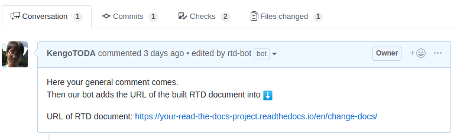

# Get the staging document in PR


[](http://commitizen.github.io/cz-cli/)
[](https://github.com/semantic-release/semantic-release)
[](https://gitpod.io/#https://github.com/KengoTODA/readthedocs-action)

Work with Read the Docs, then you'll find that PR for documentation needs additional steps like:

- running RTD build for your branch manually, to use its result as staging site [like this](https://github.com/spotbugs/spotbugs/pull/697#issue-201455071), or
- sharing screenshot to share the updated document [like this](https://github.com/spotbugs/spotbugs/pull/718#issue-205904835).

This GitHub Action automates the first approach; activate RTD build automatically when you made PR that updates the document.



## How to use

From v2, this system only works as a GitHub Action. v1 worked as a service (GitHub Probot) too.

### Initial setup

0. Make sure that your RTD project has been [connected with GitHub repository](https://docs.readthedocs.io/en/latest/getting_started.html#sign-up-and-connect-an-external-account), or [integrated via GitHub webhook](https://docs.readthedocs.io/en/latest/webhooks.html#github).
1. Add a step to your GitHub Actions workflow. Here is a sample `.github/workflows/build.yml`:

```yml
name: Documentation
on:
  pull_request_target:
    paths:
      - "docs/**"
    types:
      - opened
      - reopened
      - synchronize
      - closed # necessary to deactivate the version in Read the Docs
permissions:
  pull-requests: write
  checks: write
jobs:
  staging:
    runs-on: ubuntu-latest
    steps:
      - name: Deploy to the staging site
        uses: KengoTODA/readthedocs-action@main
        with:
          github-token: ${{ secrets.GITHUB_TOKEN }}
          rtd-token: ${{ secrets.RTD_TOKEN }}
          rtd-project: your-read-the-docs-project
```

Here `secrets.RTD_TOKEN` is the token issued by [Read the Docs](https://readthedocs.org/). See [official doc](https://docs.readthedocs.io/en/stable/api/v3.html#token) for detail.

## Advanced Configuration

### Configuration for the project with translations

If you use [translations feature](https://docs.readthedocs.io/en/latest/localization.html#project-with-multiple-translations), make sure you've configured all your RTD projects including translations.

Set the project slug of the root RTD project to `project` config.

## Migrating from v1 to v2

1. Uninstall the [GitHub App](https://github.com/settings/apps/rtd-helper) from your repository.
2. Remove the`.github/config.yml` file that is no longer needed.
3. Set one GitHub Secrets `RTD_TOKEN`, and
4. Create a GitHub Actions workflow file to run the Action.
5. Stop inviting the `rtd-bot` RTD account as maintainer.

## Alternative Solutions

From 2021 Feb, [Read the Docs officially provides the Pull Request Builders](https://blog.readthedocs.com/pull-request-builder-general-availability/).

## License

Copyright &copy; 2018-2021 Kengo TODA

```
Licensed under the Apache License, Version 2.0 (the "License");
you may not use this file except in compliance with the License.
You may obtain a copy of the License at

    http://www.apache.org/licenses/LICENSE-2.0

Unless required by applicable law or agreed to in writing, software
distributed under the License is distributed on an "AS IS" BASIS,
WITHOUT WARRANTIES OR CONDITIONS OF ANY KIND, either express or implied.
See the License for the specific language governing permissions and
limitations under the License.
```

The RTD Helper's avatar is designed by [MAM2](https://dribbble.com/MAM2).
